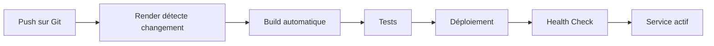

# 🚀 Guide de Déploiement sur Render

Ce guide vous explique comment déployer MediScribe sur Render.com et résoudre les problèmes courants.

## 📋 Prérequis

- Compte Render.com (gratuit ou payant)
- Compte Supabase avec projet configuré
- Clé Service Role de Supabase (CRITIQUE pour le fonctionnement)
- Repository Git avec le code

## 🔧 Configuration Render

### Étape 1 : Créer le service Backend API

1. **Aller sur Render Dashboard** → New → Web Service

2. **Connecter votre repository Git**

3. **Configuration du service :**
   ```
   Name: mediscribe-api
   Region: Frankfurt (ou Oregon, Singapore)
   Branch: main
   Runtime: Node
   Build Command: npm install
   Start Command: node server.mjs
   Plan: Starter (ou Free pour tester)
   ```

4. **Variables d'environnement CRITIQUES :**

   ```bash
   # Production
   NODE_ENV=production
   PORT=3001

   # Supabase (OBLIGATOIRE)
   VITE_SUPABASE_URL=https://votre-projet.supabase.co
   VITE_SUPABASE_ANON_KEY=eyJhbGc...
   SUPABASE_SERVICE_ROLE_KEY=eyJhbGc...  # TRÈS IMPORTANT !

   # Sécurité (Render peut générer automatiquement)
   VITE_ENCRYPTION_KEY=votre-cle-32-caracteres-minimum
   SESSION_SECRET=votre-secret-session

   # Optionnel
   SENTRY_DSN=https://...  # Pour le monitoring
   ```

   ⚠️ **CRITIQUE** : La `SUPABASE_SERVICE_ROLE_KEY` est ESSENTIELLE pour que la sauvegarde des clés API fonctionne. Sans elle, vous aurez des erreurs de permissions RLS.

5. **Health Check :**
   ```
   Health Check Path: /api/health
   ```

6. **Déployer** → Le service sera disponible à `https://mediscribe-api.onrender.com`

### Étape 2 : Créer le service Frontend

1. **Nouveau service** → Static Site (ou Web Service)

2. **Configuration :**
   ```
   Name: mediscribe-frontend
   Region: Frankfurt (même région que l'API)
   Branch: main
   Build Command: npm install && npm run build
   Publish Directory: dist
   Plan: Starter
   ```

3. **Variables d'environnement :**

   ```bash
   # API Backend (URL de votre service API créé à l'étape 1)
   VITE_API_URL=https://mediscribe-api.onrender.com

   # Supabase
   VITE_SUPABASE_URL=https://votre-projet.supabase.co
   VITE_SUPABASE_ANON_KEY=eyJhbGc...

   # Security (MÊME CLÉ que le backend)
   VITE_ENCRYPTION_KEY=votre-cle-32-caracteres-minimum

   # App Config
   VITE_APP_ENV=production
   VITE_APP_NAME=MediScribe
   VITE_ENABLE_DEBUG_LOGS=false
   ```

4. **Déployer** → Le site sera disponible à `https://mediscribe-frontend.onrender.com`

## 🔒 Obtenir la SUPABASE_SERVICE_ROLE_KEY

1. Aller sur votre projet Supabase
2. Settings → API
3. Copier la clé `service_role` (pas `anon`!)
4. ⚠️ **NE JAMAIS** exposer cette clé côté frontend

## 🐛 Résolution des Problèmes Courants

### Problème 1 : "La sauvegarde de clé API tourne sans fin"

**Cause :** 
- Timeout réseau sur Render (plan Free)
- Problème de rechargement du profil

**Solution appliquée dans le code :**
```typescript
// Dans Settings.tsx - Augmentation du timeout et meilleur feedback
setTimeout(async () => {
  await refreshProfile();
  await loadCurrentApiKey();
}, 2000); // Attendre 2 secondes
```

**Vérifications :**
1. Vérifier que `SUPABASE_SERVICE_ROLE_KEY` est bien définie
2. Tester l'endpoint : `curl https://votre-api.onrender.com/api/health`
3. Vérifier les logs Render pour voir les erreurs

### Problème 2 : "Utilisateur non connecté" lors de la transcription

**Cause :**
- La vérification `if (!user || !profile)` bloque car le profil peut être en cours de chargement
- Le user existe mais profile est temporairement null

**Solution appliquée dans le code :**
```typescript
// Dans RecordPage.tsx - Vérification améliorée
if (!user) {
  toast({
    title: 'Erreur',
    description: 'Utilisateur non connecté.',
    variant: 'destructive',
  });
  return;
}

// Le profil n'est plus obligatoire pour la transcription
// car on récupère la clé API directement depuis Supabase
```

### Problème 3 : Erreurs CORS

**Solution :**
Ajouter l'URL de votre frontend dans `server.mjs` :

```javascript
const allowedOrigins = process.env.NODE_ENV === 'production'
  ? [
      'https://mediscribe-frontend.onrender.com',
      'https://votre-domaine-custom.com'
    ]
  : ['http://localhost:8080'];
```

### Problème 4 : Le service s'endort (plan Free)

**Render Free tier** : Les services s'endorment après 15 min d'inactivité

**Solutions :**
1. Passer au plan Starter ($7/mois)
2. Utiliser un service de ping (UptimeRobot, Cron-job.org)
3. Ajouter un healthcheck externe

## 📊 Monitoring

Une fois déployé, surveillez :

1. **Health Check** : `https://votre-api.onrender.com/api/health`
2. **Logs Render** : Dashboard → Logs
3. **Métriques** : `https://votre-api.onrender.com/api/metrics`
4. **Dashboard** : `https://votre-api.onrender.com/dashboard`

## 🔄 Workflow de Déploiement



## 📝 Checklist Avant Déploiement

- [ ] Variables d'environnement configurées
- [ ] `SUPABASE_SERVICE_ROLE_KEY` définie (CRITIQUE!)
- [ ] `VITE_ENCRYPTION_KEY` identique frontend/backend
- [ ] URL API correcte dans le frontend
- [ ] CORS configuré avec les bonnes URLs
- [ ] Health check actif
- [ ] Logs vérifiés

## 🚨 Variables d'Environnement Critiques

| Variable | Où ? | Obligatoire ? | Description |
|----------|------|---------------|-------------|
| `SUPABASE_SERVICE_ROLE_KEY` | Backend | ✅ OUI | Clé service role pour bypass RLS |
| `VITE_ENCRYPTION_KEY` | Les deux | ✅ OUI | Clé de chiffrement (≥32 caractères) |
| `VITE_API_URL` | Frontend | ✅ OUI | URL de l'API backend |
| `VITE_SUPABASE_URL` | Les deux | ✅ OUI | URL projet Supabase |
| `VITE_SUPABASE_ANON_KEY` | Les deux | ✅ OUI | Clé anonyme Supabase |
| `SESSION_SECRET` | Backend | ✅ OUI | Secret pour sessions |
| `SENTRY_DSN` | Backend | ❌ Non | Pour monitoring erreurs |

## 🧪 Test Post-Déploiement

1. **Tester l'API :**
   ```bash
   curl https://votre-api.onrender.com/api/health
   # Devrait retourner: {"status":"OK","ai_provider":"Mistral AI"}
   ```

2. **Tester le frontend :**
   - Ouvrir `https://votre-frontend.onrender.com`
   - Se connecter
   - Aller dans Paramètres → Clé API
   - Sauvegarder une clé API test
   - Vérifier que ça fonctionne (pas de timeout)

3. **Tester la transcription :**
   - Nouvelle consultation
   - Enregistrer un audio test
   - Vérifier que la transcription fonctionne
   - Pas de message "Utilisateur non connecté"

## 💡 Conseils de Performance

1. **Utiliser la même région** pour frontend et backend (latence réduite)
2. **Plan Starter** recommandé pour production (pas de sleep)
3. **CDN** : Render inclut un CDN pour les static sites
4. **Caching** : Activer le cache des assets statiques

## 🔐 Sécurité

- ✅ HTTPS automatique avec Render
- ✅ Service Role Key uniquement côté backend
- ✅ CORS configuré avec domaines spécifiques
- ✅ Headers de sécurité (Helmet)
- ✅ Rate limiting activé
- ✅ Sessions sécurisées

## 📞 Support

En cas de problème :
1. Vérifier les logs Render
2. Tester les endpoints manuellement
3. Vérifier les variables d'environnement
4. Consulter ce guide

---

**Dernière mise à jour** : Octobre 2025
**Version MediScribe** : 2.0.0
